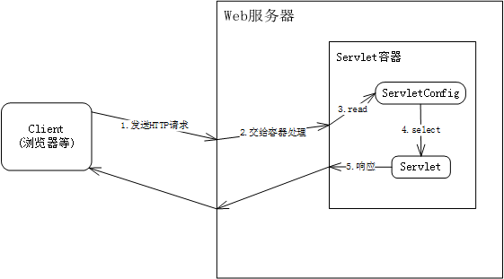

# Servlet Demo

## 什么是Servlet
Servlet是基于Java技术的Web组件，由容器管理，可生成动态内容。Servlet也是与平台无关的java类，被编译成与平台无关的字节码，可被支持Java技术的Web服务器动态加载并运行。

Servlet通过容器实现的请求/响应模式与Web客户端进行交互。

## 什么是Servlet容器
Servlet容器是Web服务器或应用服务器的一部分，提供发送请求和响应的网络服务，解码基于MIME的请求，并格式化为MIME的响应。

Servlet容器还包含并管理生命周期中的Servlet。Servlet容器必须支持HTTP协议，其他基于请求/响应的协议是可选的。

## 处理流程

1. 客户端访问Web服务器，并发送HTTP请求
2. Web服务器接收请求，并转交给Servlet容器
3. Servlet容器根据Servlet配置确定要调用哪个Servlet，并传递请求和响应对象进行调用
4. Servlet执行完后，动态产生响应内容发送给客户端。
5. Servlet容器确保响应正确输出，并将控制权还给Web服务器。

## 核心功能

[Servlet接口](./servlet.md)